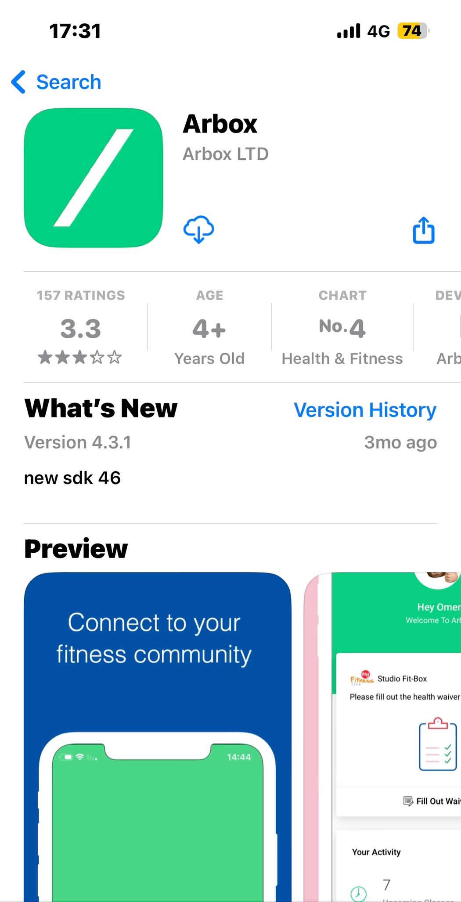
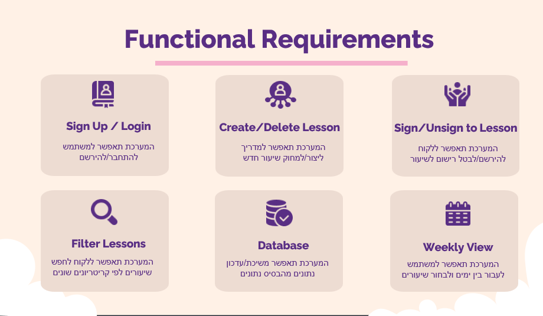
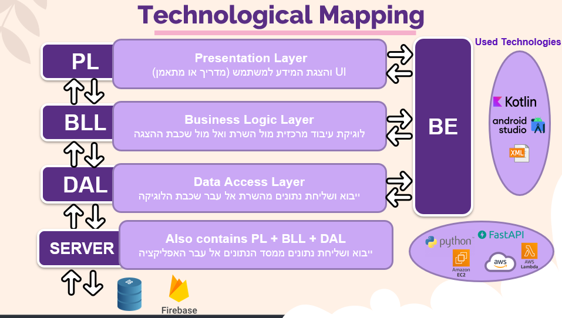
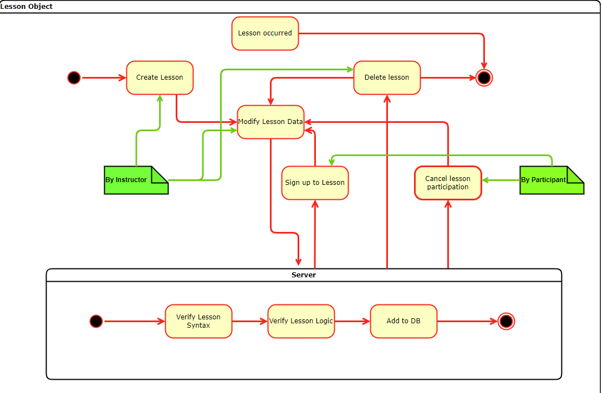
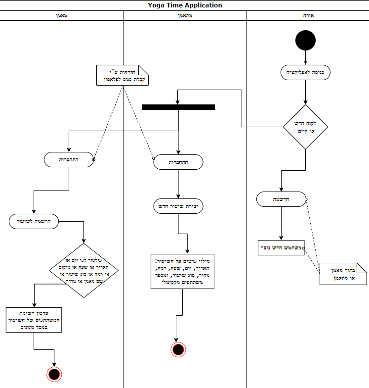
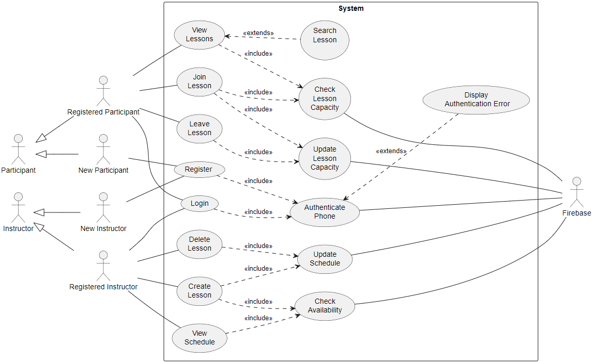

# Yoga Time


## Introduction
Yoga Time is a mobile application that provides the ultimate solution for joining Yoga sessions and increasing the convinency of finding instructors.
Our app connects individuals seeking flexible, short-term, and long-term Yoga sessions with instructors of all the various types of Yoga.
In addition, we provide an easy way for instructors to gain new clients in a user friendly way.

## Our Team
Yanir Cohen  
Netanel Levine  
Nir Sasson


### Repositories:
**App** - [GitHub - Yoga_Time](https://github.com/SassonNir/Yoga_Time)  
```
The application was built in Android Studio and we used Kotlin.
```

**Server** - [GitHub - Python Server API](https://github.com/netanellevine/python_server_api)  
```
The server was built in Python on AWS EC2 using Fast-API.
```
### Links:
**Power Points Presentation** - [Yoga Time Presentation.pptx](https://docs.google.com/presentation/d/1iTOGPQOF3YR8NQxMLglVGIGIDxNSVEo3/edit?usp=sharing&ouid=113841670198344735182&rtpof=true&sd=true)   

 
 
 

**Product demo video** - [Yoga Time Demo.mp4](https://drive.google.com/drive/folders/1eeKInlLYv7R0CrO9s0jrMr5sbE_H5TDs)

## Problem vs. Solution

### Problem:  
Nowadays there isn’t a platform for small Yoga Studios or private Yoga instructors to manage their lessons and extend their number of  customers.


### Solution:  
Yoga Time enables all sorts of businesses an easy and a simple way for mannaging their lessons.   
For the customers it provides the best solution for getting to know new instructors and prevents the monoply of the big businesses in the market.

## Our Competitors
**Arbox**  


**Them** - Expensive and require the business to pay a lot of money per month. Clients can’t compare between several studios  
**Us** - Cheap and easy to useClients can see all the business filter and search for what they desire

## Functional Requirements
  


## Non-Functional Requirements

   

## Technological Mapping



## Design Goals


## Future Work


## Diagrams

### State Machine Diagram


### Activity Diagram


### Use Case Diagram


### More Diagrams
 [Entity Relations Diagram](/pptimages/image25.png)  
 
 [Sequence Diagram](/pptimages/image24.png)  
 
 [Class Diagram](/pptimages/Class_Diagram-0.svg)  
 

